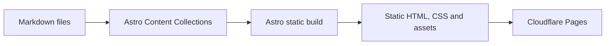

# Architecture

## Static-site architecture

Astro đọc Markdown trong Content Collections khi build và tạo HTML, CSS cùng assets tĩnh. Không có server runtime, API hay database.

## Luồng nội dung và route

Bài được đặt trong `src/content/interview/` và được kiểm tra bởi schema trong `src/content.config.ts`. Ở phase sau, Astro sẽ đọc collection để sinh `/interview/` và `/interview/[slug]/`. Template trong `docs/examples/` nằm ngoài collection nên không thể xuất bản nhầm.

## Ranh giới thư mục

- `src/content`: nội dung và metadata có validation.
- `src/layouts`: khung HTML, metadata, CSS dùng chung.
- `src/components`: phần giao diện tái sử dụng khi thật sự cần.
- `src/pages`: định nghĩa route và ghép dữ liệu với layout.
- `public/images/interview`: hình tĩnh cho bài; `src/assets` cho tài nguyên được xử lý qua build.

## Hình ảnh

Đặt ảnh bài interview tại `public/images/interview/` với tên mô tả, không dấu, dùng dấu gạch ngang. Chỉ thêm ảnh hỗ trợ nội dung, luôn có alt text có nghĩa. Tài sản cần Astro xử lý có thể đặt trong `src/assets`.

## Client JavaScript

Ưu tiên HTML và CSS. Chỉ bổ sung JavaScript phía client cho tương tác có giá trị rõ ràng, cô lập phạm vi và không ảnh hưởng luồng đọc nội dung chính.

## Khả năng mở rộng và deploy

Schema tập trung, layout tách biệt và route theo slug giúp bổ sung category, tag, RSS và search mà không thay đổi nội dung nguồn. Ở bước sau, production output `dist/` sẽ được deploy lên Cloudflare Pages.
